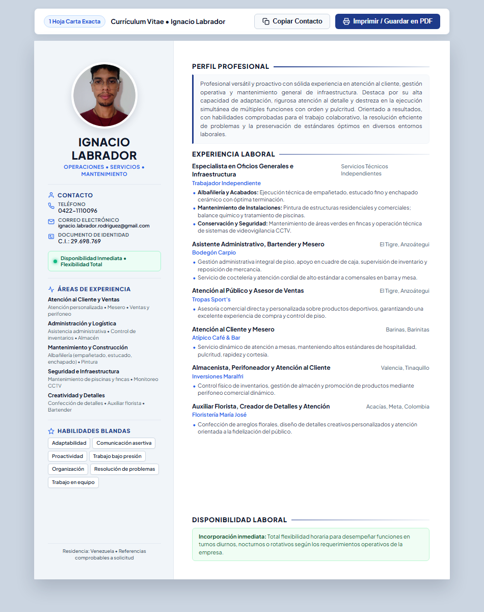

# Currículum Vitae - Ignacio Labrador

Currículum profesional de **Ignacio Labrador** diseñado en formato web HTML y optimizado para exportación directa a PDF en 1 sola página tamaño Carta (Letter 8.5" x 11").

---

## 📄 Archivos del Repositorio

- **`index.html`**: Currículum vitae web interactivo, responsive y con estilos de impresión optimizados.
- **`curriculum_ignacio_labrador.pdf`**: Documento listo para postulación laboral en 1 sola página exacta.
- **`foto_ignacio.png`**: Fotografía de perfil optimizada con marco circular.
- **`build_cv.py`**: Script en Python para recompilar el HTML e incrustar la imagen en formato base64.

---

## 🚀 Visualización y Uso

1. Puedes abrir `index.html` en cualquier navegador web moderno (Google Chrome, Microsoft Edge, Mozilla Firefox, Safari).
2. Para guardarlo en PDF:
   - Haz clic en el botón superior **"Imprimir / Guardar en PDF"** (o usa el atajo `Ctrl + P`).
   - Elige **"Guardar como PDF"** como destino.
   - El documento está programado para ajustarse exactamente a 1 hoja sin páginas vacías.
3. Para copiar los datos de contacto:
   - Haz clic en **"Copiar Contacto"** en la barra superior.
